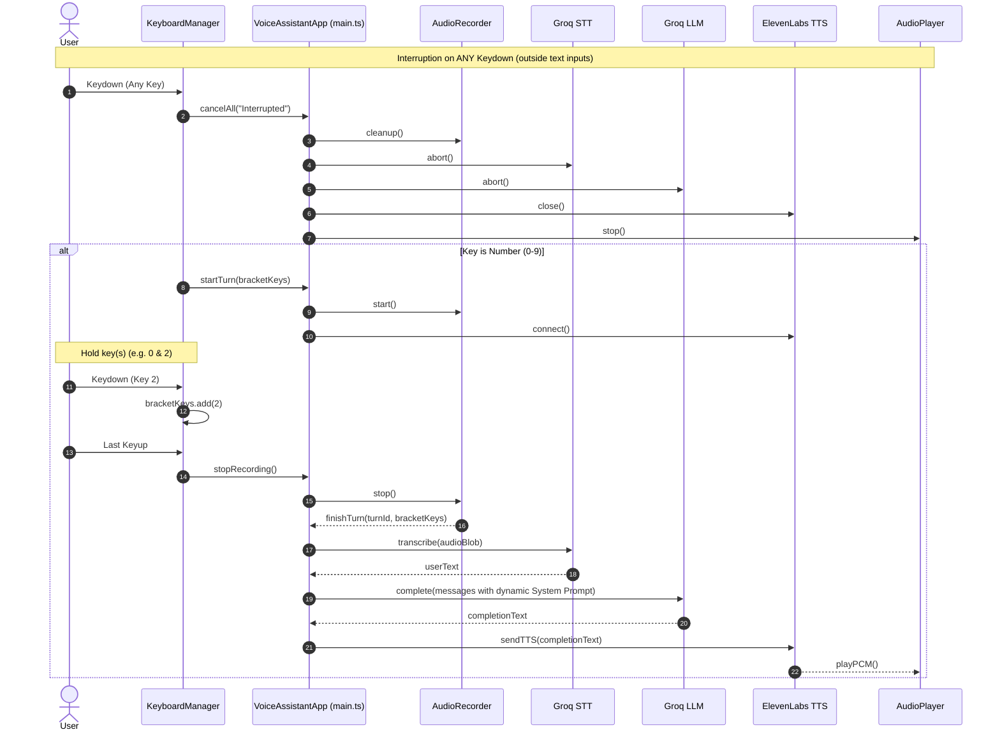

# RFC-01: Multi-System Prompt Multiplexed Thread

## 1. Overview

This RFC defines the architecture and implementation plan for transforming the single-turn voice assistant into a multi-turn, multi-system-prompt multiplexed voice chat experience grounded directly on top of the existing `VoiceAssistantApp` in `src/main.ts`.

The system allows users to press and hold number keys (`0`-`9` or Numpad `0`-`9`) to record voice input and direct it to one or more selected context items (system prompts). The chat maintains a single conversational thread that builds up over time, while each turn dynamically composes an overarching system prompt containing active `<context>` items.

---

## 2. Core Requirements & Feasibility Analysis

### 2.1 Grounded Integration with `main.ts` Architecture

The current `VoiceAssistantApp` lifecycle in `src/main.ts` uses:

- `turnId`: Monotonically increasing identifier to invalidate superseded async tasks.
- `cancelAll(message)`: Aborts active `AbortController` (STT/LLM), closes ElevenLabs TTS WebSocket, cleans up `AudioRecorder`, and stops `AudioPlayer`.
- `startTurn()`: Pre-connects TTS WebSocket while recording audio via `AudioRecorder`.
- `finishTurn(currentTurn)`: STT transcription $\rightarrow$ LLM completion $\rightarrow$ TTS audio playback.

### 2.2 Key Bracketing & Interruption Lifecycle

1. **Target Element Filtering & Special Key Capture Input Box (iOS Virtual Keyboard Support)**:
   - **iOS Virtual Keyboard Challenge**: iOS Mobile Safari does not fire global `window` level `keydown`/`keyup` events for virtual software keyboards unless a text `<input>` or `<textarea>` is actively focused.
   - **Key Capture Input Box**:
     - We introduce a dedicated `<input id="keyCaptureInput" type="text" inputmode="numeric" autocomplete="off">` in the UI.
     - Tapping/focusing this input brings up the iOS virtual keyboard/keypad.
     - Event listeners (`keydown`, `keyup`, `input`, `beforeinput`) are attached directly to both `keyCaptureInput` and `window`.
     - The capture box content is kept clear/empty (`input.value = ''`) after reading typed digits, preventing text overflow while continually capturing virtual keyboard inputs.
     - Other editable settings inputs (Groq/ElevenLabs keys, context slot text fields) are treated as configuration controls and ignored for key-bracket triggering.
2. **Key Repeat Handling (`event.repeat`)**:
   - `event.repeat` is ignored so holding down a key does not emit spurious start/stop events or repeated cancellations.
3. **Immediate Interruption (Requirement 9)**:
   - Any valid `keydown` or `beforeinput` (outside configuration text fields) immediately triggers `app.cancelAll("Cancelled")`.
   - This aborts STT/LLM requests, closes TTS sockets, and stops audio playback instantly.
4. **Key Bracket Lifecycle (`0`-`9` and Numpad `0`-`9`)**:
   - **Bracket Start (First Keydown / Touch / Input)**:
     - Calls `cancelAll(null)` to interrupt any ongoing turn.
     - Initializes `bracketKeys = Set([keyIndex])` and `activeKeys = Set([keyIndex])`.
     - Starts recording (`app.startTurn(bracketKeys)`).
   - **Key Accumulation**:
     - Subsequent number keydowns while `activeKeys.size > 0` are added to `bracketKeys` and `activeKeys`.
     - UI highlights active keys in real time.
   - **Bracket End (Last Keyup / Touch End)**:
     - Keyup removes key from `activeKeys`.
     - When `activeKeys.size === 0`, recording stops (`app.stopRecording()`), passing `bracketKeys` to `finishTurn()`.
5. **Touch / On-Screen Keypad Support**:
   - The UI includes on-screen touch buttons for slots `0`–`9` supporting `pointerdown`/`pointerup`/`pointercancel` to handle press-and-hold bracketing directly on mobile devices alongside the virtual keyboard input capture box.

### 2.3 Context Items & Overarching Prompt Spec

1. **10 Context Item Slots (`0`..`9`)**:
   - Managed by `ContextManager`. Editable in the UI, stored in `localStorage`.
2. **Overarching Prompt Format**:

   ```xml
   Complete user's sentence in the most sensible way in first-person voice ('I ...').
   Respond only with a few words to fill the __ as if uttered by the user themselves.

   <context index="0">My name is Alex and I am 28 years old.</context>
   <context index="2">I work as a software engineer building voice applications.</context>
   ```

### 2.4 Multi-turn Conversational History (`ThreadManager`)

- Maintains thread history array: `Array<{ role: 'user' | 'assistant', content: string }>`.
- For each turn completion, `GroqService.complete()` receives:
  1. `{ role: 'system', content: dynamicSystemPrompt }`
  2. Previously accumulated `user` and `assistant` messages.
  3. The current turn's user message with ` __` placeholder suffix.
- Appends the turn transcript and response to history upon successful completion.

---

## 3. Architecture & Interaction Flow



---

## 4. Component Implementation Details

### 4.1 `KeyboardManager` (`src/ui/KeyboardManager.ts`)

- Binds listeners to both `window` and the dedicated `<input id="keyCaptureInput">` element (with `inputmode="numeric"` for iOS virtual keyboard trigger).
- Listens to `keydown`, `keyup`, `beforeinput`, and `input` events.
- Clears `keyCaptureInput.value` on every input tick to keep it ready for continuous key presses.
- Also binds `pointerdown`, `pointerup`, and `pointerleave` / `pointercancel` on visual on-screen keypad buttons `0`–`9` for touch device fallback.
- Filters out events originating from context slot configuration inputs or API key inputs.
- Ignores `event.repeat`.
- Maps physical keys (`Digit0`..`Digit9`, `Numpad0`..`Numpad9`) and input digits (`'0'`..'9'`) $\rightarrow$ slot index `0`..`9`.
- Tracks `activeKeys: Set<number>` and `bracketKeys: Set<number>`.
- Triggers callbacks: `onInterrupt`, `onBracketStart`, `onBracketUpdate`, `onBracketEnd`.

### 4.2 `ContextManager` (`src/chat/ContextManager.ts`)

- Holds array of 10 string slots (`0`..`9`).
- Initializes default 10 simple first-person facts:
  - `0`: "My name is Alex and I am 28 years old."
  - `1`: "I live in San Francisco, California."
  - `2`: "I work as a software engineer building voice applications."
  - `3`: "My favorite hobby is playing acoustic guitar."
  - `4`: "I have a golden retriever named Buster."
  - `5`: "I am fluent in English and Spanish."
  - `6`: "My favorite food is authentic Italian pasta."
  - `7`: "I am building a web-based speech synthesis interface."
  - `8`: "I prefer working in the morning when my mind is sharpest."
  - `9`: "I am planning a vacation trip to Japan next spring."
- Builds overarching system prompt given selected slot indices array.
- Persists user edits to `localStorage`.

### 4.3 `ThreadManager` (`src/chat/ThreadManager.ts`)

- Maintains history of turns: `{ user: string; assistant: string }[]`.
- Generates OpenAI/Groq compatible chat messages array:
  - System message with current turn's dynamic context.
  - Interleaved past `user` and `assistant` messages.
  - Current `user` text + ` __`.

### 4.4 `GroqService` Refactoring (`src/chat/GroqService.ts`)

- Update `complete()` signature: `complete(apiKey: string, messages: ChatMessage[], signal?: AbortSignal): Promise<string>`.

### 4.5 `UIManager` Extensions (`src/ui/UIManager.ts`, `index.html`, `src/style.css`)

- Renders 10 context slot text inputs in UI.
- Displays active key indicators (`0`..`9`) for visual feedback during bracket holding.
- Renders prompt index tags in results (e.g. `[Prompts: 0, 2]`).
- Includes a "Clear Thread" button to reset conversation history.

---

## 5. Feasibility Verification & Step-by-Step Execution Plan

1. **Verification**:
   - Fully compatible with `VoiceAssistantApp`'s `turnId` invalidation model.
   - Handled text input isolation so slot inputs and API key fields work seamlessly.
   - Preserves pre-connecting TTS connection model for minimum latency.

2. **Execution Steps**:
   - **Step 1**: Implement `ContextManager` (`src/chat/ContextManager.ts`).
   - **Step 2**: Implement `ThreadManager` (`src/chat/ThreadManager.ts`).
   - **Step 3**: Refactor `GroqService` (`src/chat/GroqService.ts`) for multi-message chat array.
   - **Step 4**: Implement `KeyboardManager` (`src/ui/KeyboardManager.ts`).
   - **Step 5**: Update UI layout, styles, and controls in `index.html`, `style.css`, and `UIManager.ts`.
   - **Step 6**: Wire components in `VoiceAssistantApp` (`src/main.ts`).
   - **Step 7**: Validate build & test turns, key bracketing, and interruptions.
