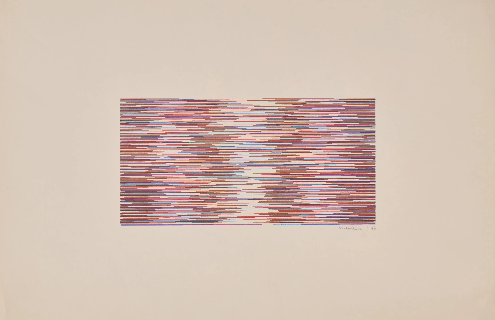
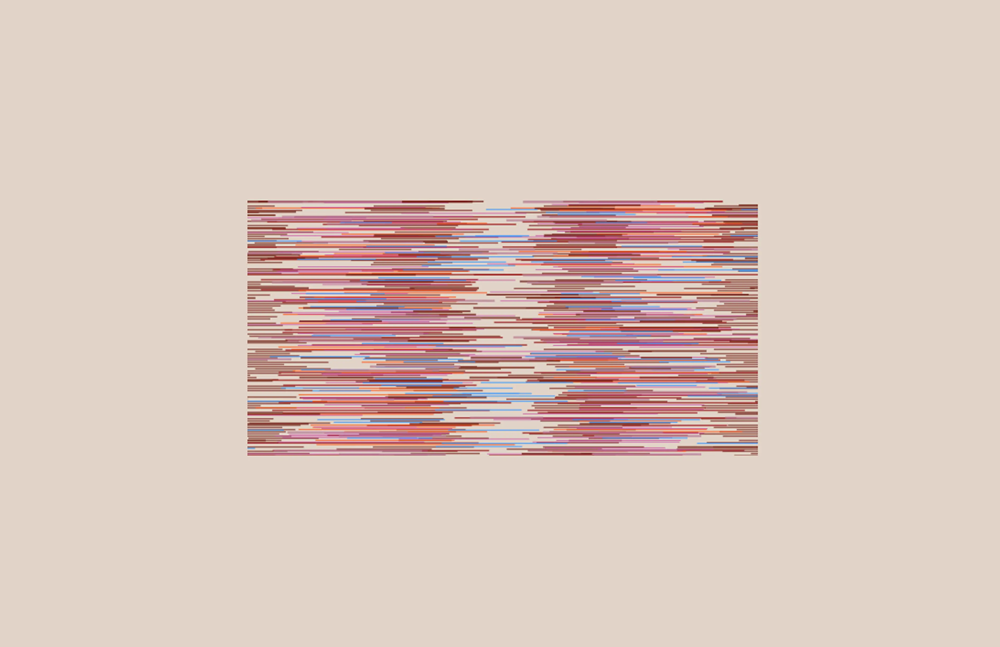

# Vera Molnár

- [Vera Molnar, artist proof; Signed “V. Molnar / 73” on front, “MIKΡOKOΣMOΣ / epreuve d’artiste, c-5 II” inscribed on verso.](https://observer.com/2025/07/auctions-sothebys-algorithmic-art-computer-art-grace-hertlein-collection/) 
- [Live](./molnar/)
- Notes
  - Original artwork combines structure with randomness
  - There appears to be a 1,2,4 column layout governing the vertical rhythm
  - Perlin noise applied to the length varition as we render from top to bottom
  - A lot of manual parameter tweaking until the dense-sparse-dense-empty-dense-sparse-dense rhythm felt right
  - Vibe coded [a tool](https://code.chuanqisun.com/color-analyzer/) to extract color palette from any image

| Original | Recreated |
|----------|-----------|
|  |  |

