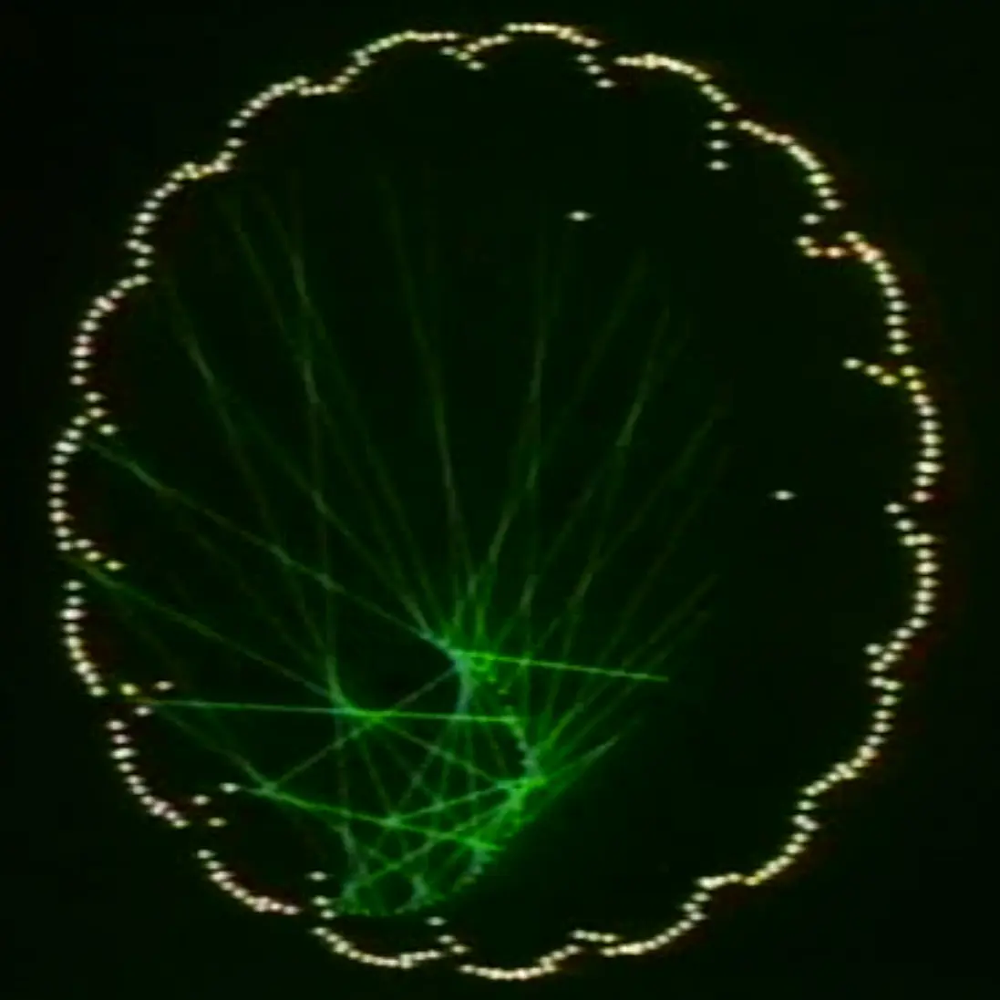
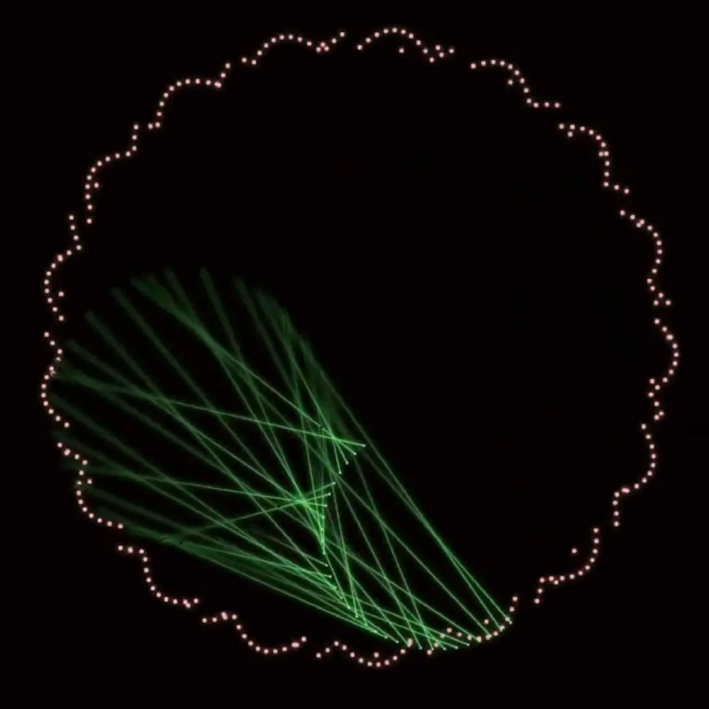
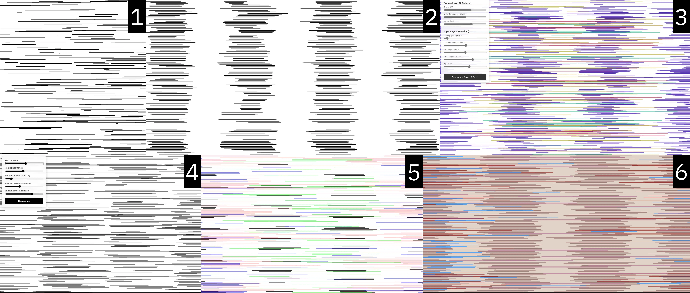

# Recreating The Past

## Week 2: John Whitney

### Read

> Art is a question of 'you be me'... My excitement in life is to discover something that's significant to me... and not to think, 'Well, I wonder if so-an-so's
> going to like this.'"
> — [Len Lye](https://www.dropbox.com/s/7tmeb0cki0biyit/Articulated%286013%29.pdf?dl=0), by Cecile Starr

### Watch

- [Tutorial on trigonometry](https://www.dropbox.com/s/eadyb0vfsubmzn5/async_5_21.mp4?dl=0)

### Practice

| [Original](https://youtu.be/UA_QcM7Ai1A)                | [Recreated](https://youtube.com/shorts/ghtOiaavP-8)       |
| ------------------------------------------------------- | --------------------------------------------------------- |
|  |  |

- Notes
  - [Live demo](./whitney/), you can play the [sound track](https://strudel.cc/#YXdhaXQgc2FtcGxlcygnZ2l0aHViOnRpZGFsY3ljbGVzL2RpcnQtc2FtcGxlcycpCgokOiBzdGFjaygKICBzKCJ0YWJsYTowIikKICAgIC5kZWdyYWRlQnkoMC41KQogICAgLnN0cnVjdCgieCB%2BIH4gfiB4IH4gfiB%2BIikKICAgIC5nYWluKDEuMCksCgogIHMoInRhYmxhOjMiKQogICAgLnN0cnVjdCgifiB%2BIHggfiB%2BIHggfiB%2BIikKICAgIC5kZWdyYWRlQnkoMC4yKQogICAgLmdhaW4oMC43NSksCgogIHMoInRhYmxhOjIiKQogICAgLnN0cnVjdCgifiB4IH4geCB%2BIH4geCB%2BIikKICAgIC5kZWdyYWRlQnkoMC4yKQogICAgLmdhaW4oMC41NSkuc2xvdygyKSwKCiAgcygiaGgiKQogICAgLnN0cnVjdCgifiB4IH4geCB%2BIHggfiB4IikKICAgIC5nYWluKDAuMjUpCiAgICAuc3dpbmcoNCkKICAgIC5kZWdyYWRlQnkoMC4yKQogICAgLnJvb20oMC4zKSwKCiAgcygibWV0YWw6MiIpCiAgICAuc3RydWN0KCJ4IH4gfiB%2BIH4gfiB%2BIH4gfiB%2BIH4gfiB4IH4gfiB%2BIikKICAgIC5nYWluKDAuNDUpCiAgICAuc3BlZWQoMi41KQogICAgLnJvb20oMC40KQogICAgLnBhbigwLjcpLAoKCiAgbm90ZSgiZDIiKQogICAgLnMoImdtX2Fjb3VzdGljX2Jhc3MiKQogICAgLnN0cnVjdCgieCB%2BIH4gfiB%2BIH4gfiB%2BIikKICAgIC5nYWluKDAuMjUpCiAgICAucm9vbSgwLjYpCiAgICAucmVsZWFzZSgxLjIpLAoKICBzKCJ0YWJsYTo1IikKICAgIC5zd2luZyg0KQogICAgLnN0cnVjdCgieCoxNiIpCiAgICAuZ2FpbigwLjUpCiAgICAuZGVncmFkZUJ5KDAuMikKKQ%3D%3D) from Strudel and share the tab with audio into the visualization app.
  - Source: John Whitney, Permutations (1969)
  - Divide and conquer: I separated the dancing dots from the lines. After solving them individually, I added the sound track to further animate the dots.
  - The green lines:
    - There are always 31 lines. They are projected from one 180 degree arc to a circle.
    - The 180 degree arc's radius oscillates, self-rotates, and orbits around the center of the screen, with orbit radius oscillating as well.
    - The endpoints on the circle is marching at speed proportional to the dots index, creating the twisting effect and periodic dense-sparse rhythm.
    - It takes calculation to both start and end the animation at a specific pattern using the periodicity of sine wave.
  - The dancing dots are achieved by applying the same principle as the circle where the green lines originate from, but in addition to step-ramp the rotation angle over time, I also modulated the radius with a circle, so they look like standing wave wrapped around a circular path.
  - I learned a little bit Strudel and composed a percussion sound track with AI's help.
  - Process
    - Lines: [motion study](./whitney/process/lines/103.html), [orbit study](./whitney/process/lines/200.html), [integration (failed)](./whitney/process/lines/300.html), [oscillation study](./whitney/process/lines/400.html), [motion decoded!](./whitney/process/lines/801.html), [choreography study](./whitney/process/lines/806.html)
    - Dots: [motion study](./whitney/process/dots/001.html), [harmonic progression study](./whitney/process/dots/002.html), [oscillation along circumference (failed)](./whitney/process/dots/003.html), [rose petals (failed)](./whitney/process/dots/004.html), [modulate radius](./whitney/process/dots/005.html)
  - Extras: [photon grammar](https://code.chuanqisun.com/photon-grammar/), [disco ball](https://code.chuanqisun.com/disco-ball/)

## Week 1: Vera Molnár

### Read

> It may take a life-time to develop a computer program to make one new communicating pen line which is meaningful for us.  
> — [Computer Grass is Natural Grass](https://www.atariarchives.org/artist/sec5.php) by Colette S. Bangert and Charles J. Bangert

### Watch

- [Tutorial on noise](https://www.dropbox.com/scl/fi/ny6pbyy4z7ww1sqs0seqr/async_5_21.mp4?rlkey=o29twftvovd6k6f692q2kyy5d&e=1&dl=0)

### Practice

| [Original](https://observer.com/2025/07/auctions-sothebys-algorithmic-art-computer-art-grace-hertlein-collection/) | [Recreated](./molnar/)                                       |
| ------------------------------------------------------------------------------------------------------------------ | ------------------------------------------------------------ |
|                                                          |  |

- Notes
  - Source: Vera Molnar, artist proof; Signed “V. Molnar / 73” on front, “MIKΡOKOΣMOΣ / epreuve d’artiste, c-5 II” inscribed on verso.
  - Original artwork combines structure with randomness
  - There appears to be a 1,2,4 column layout governing the vertical rhythm
  - Perlin noise applied to the length variation as we render from top to bottom
  - A lot of manual parameter tweaking until the dense-sparse-dense-empty-dense-sparse-dense rhythm felt right
  - Vibe coded [a tool](https://code.chuanqisun.com/color-analyzer/) to extract color palette from any image

### Extra

- [Hi(gh) Squre](./molnar/square.html)
