# Recreating The Past

## Week 5: Pixels

### Read

> If there is a teleological function to art, quite likely it is to lead
> us back to our psychological origins, to exhaust our material illusions by
> forcing us to understand the reality of mythic experience, for myths are
> merely the mental constructs we devise for our perception of the world,
> having particular properties isomorphic with the physical world. Yet
> increasingly we sense the fragility of art, the fact that modern rationalism
> tends to denude it of its most precious characteristic, its "believability."
>
> As with Norbert Wiener's comparison
> of the ancient Jewish myth of the man-made Golem with cybernetic technology,
> I envisioned the resolution of art and technology in the creation of life itself.
>
> — [Art and Technology: The Panacea That Failed](https://monoskop.org/images/4/4e/Burnham_Jack_1980_Art_and_Technology_The_Panacea_That_Failed.pdf), by Jack Burnham

### Watch

- [Pixel manipulation, convolution matrix](https://www.dropbox.com/s/j0qm8fo5y5lbvf9/async_6_18.mp4?dl=0)

### Practice

| [Original](https://www.youtube.com/watch?v=faqnx54amFE) | [Recreated](./schwartz/index.html)      |
| ------------------------------------------------------- | --------------------------------------- |
| 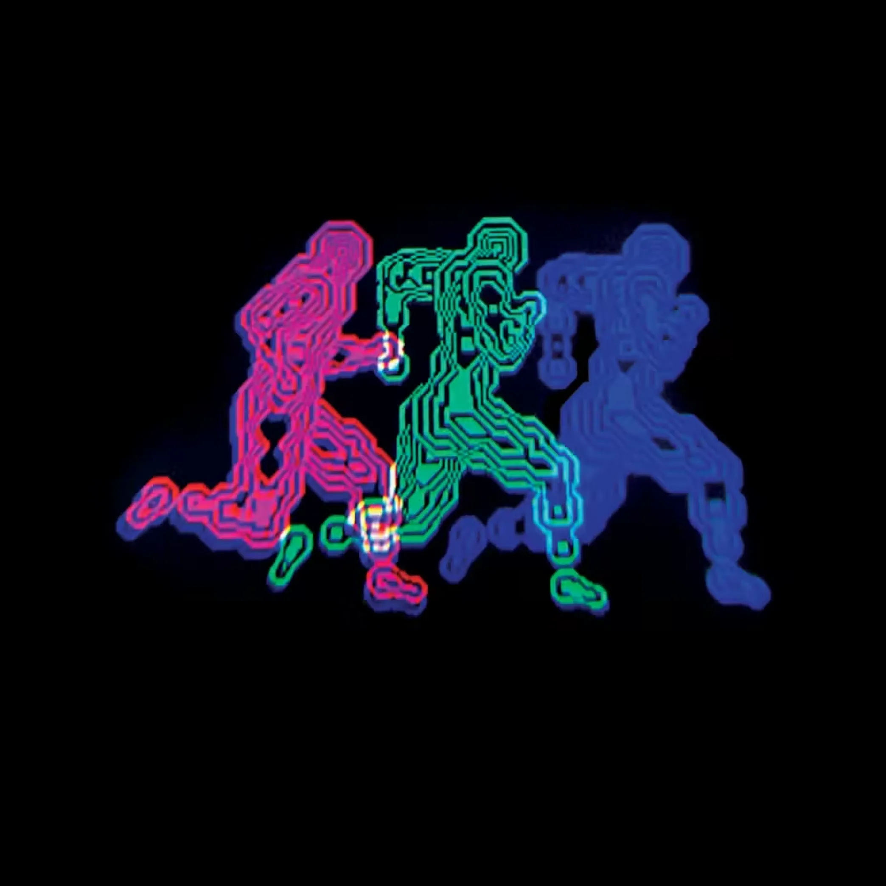                   | 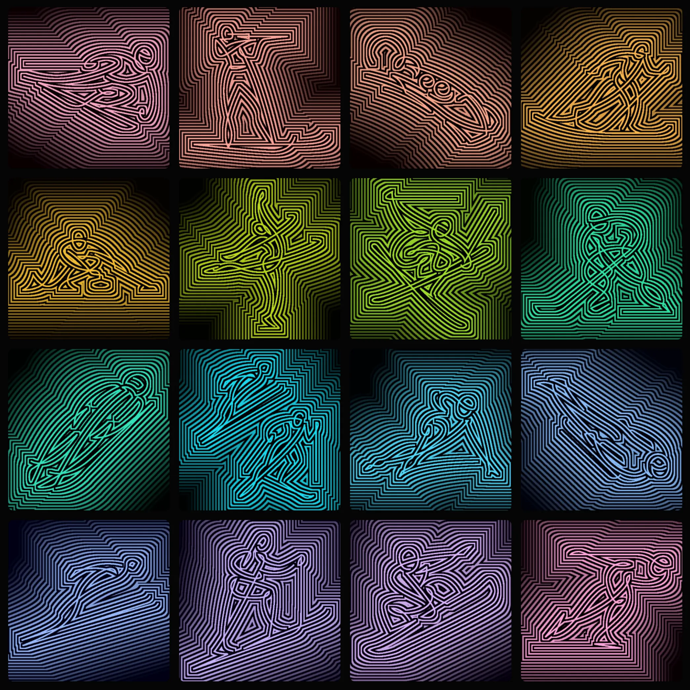 |

- Notes
  - Source: Lillian Schwartz, _Olympiad_, 1971. Image courtesy The Henry Ford Museum.
  -

## Week 4: Pattern

### Read

> Art in the academy and discourse of the academy, we are trained to find ways to speak of things that there are no words for but you know, it’s the power of colour, it’s phenomena is beyond words.  
> — [Chromatic Symphony Interview with Odili Donald Odita](https://web.archive.org/web/20240616204839/https://www.stevenson.info/sites/default/files/2011_missla_libsekal_savvy_art_contemporary_african_2011.pdf)

### Watch

- [Tutorial on patterning, loop, modulus, non-linearity](https://www.dropbox.com/s/vt316vg5tu8y6it/async_6_11.mp4?dl=0)

### Practice

| [Original](https://www.moma.org/collection/works/80954) | [Recreated (live experience)](./leparc/index.html) |
| ------------------------------------------------------- | -------------------------------------------------- |
| 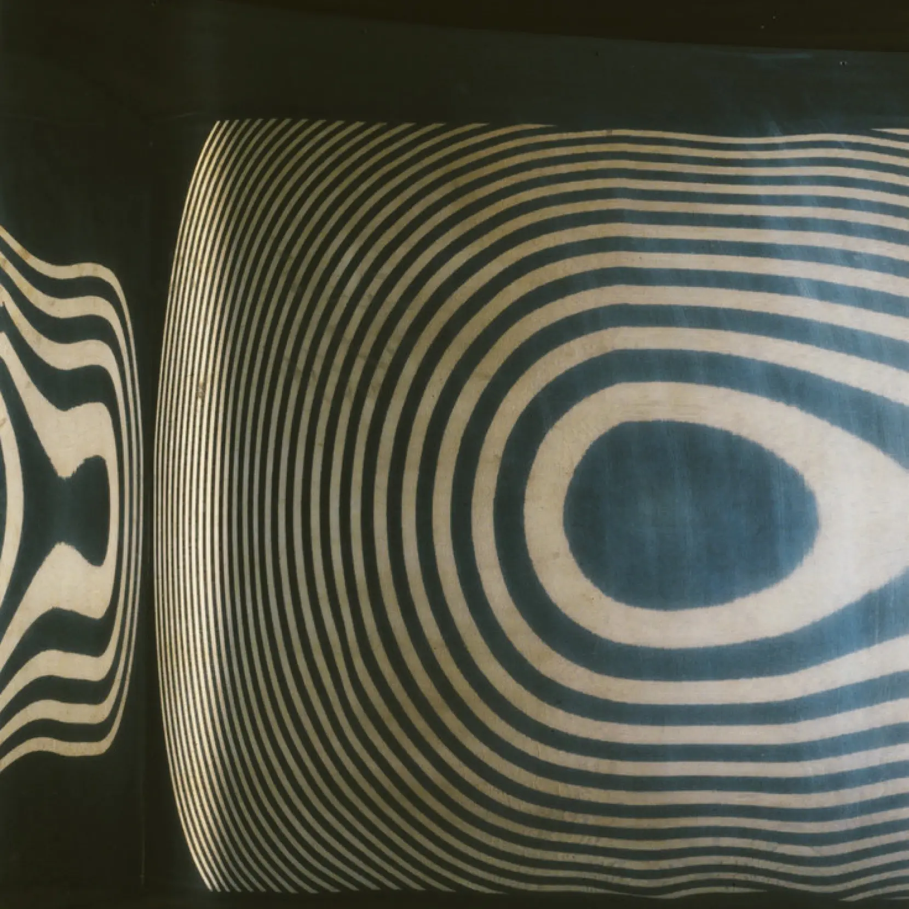                     | 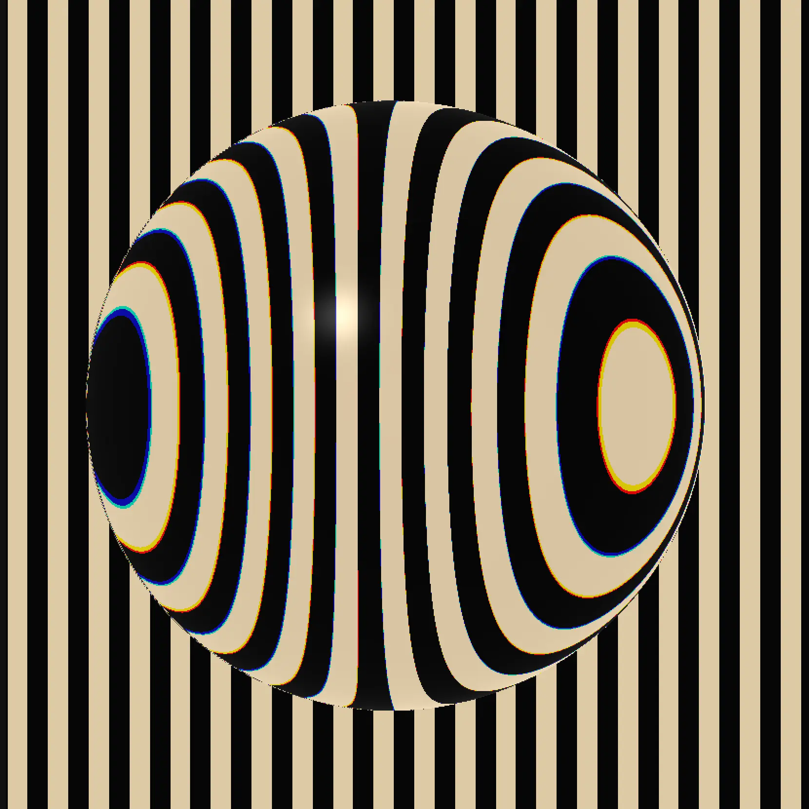              |

- Notes
  - [Live](https://code.chuanqisun.com/recreating-the-past/leparc/index.html), [Recording](https://www.youtube.com/shorts/zkKdvdRDc64), [Code](https://github.com/chuanqisun/code/tree/master/recreating-the-past/leparc/index.html),
  - Source: Julio Le Parc, Instability through Movement of the Spectator 1962-64
  - I discovered [Karl Gerstner](https://buffaloakg.org/artworks/k19654-lens-picture-no-15)’s work after the project, which is closer to what I did.
  - Op Art creates movement without movement
  - But body movement can enhance the effect and make the art participatory, as seen in the MoMA Responsive Eyes exhibition (1965)
  - If we think of Op Art as the snapshot of a lens interacting with a pattern, recreating the entire lens setup might allow us to experience the full environment that inspired the artist and reveal novel snapshots that the artist might have missed
  - Adding caustic effect to add realism
  - Tweak of parallax effect to make it feel natural on a flat screen
  - Process: [Checkerboard](https://code.chuanqisun.com/recreating-the-past/leparc/100-checker.html), [Basic Distortion](https://code.chuanqisun.com/recreating-the-past/leparc/200-droplet.html), [Interaction](https://code.chuanqisun.com/recreating-the-past/leparc/300-interactive.html), [Head tracking](https://code.chuanqisun.com/recreating-the-past/leparc/400-head-tracking.html)
  - I ported from Canvas API to Three.js in order to use shader for more realistic rendering. However, the psychological effect of Op Art can be felt without realistic rendering.
  - Extras: [Pattern and Color studies](https://code.chuanqisun.com/recreating-the-past/leparc/bridget-riley/100-pattern-study-colored.html), [Tiling studies](https://code.chuanqisun.com/zero-sum-game/)

## Week 3: Computational Typography

Artists: Muriel Cooper, John Maeda

### Read

> A poem only communicates if read slowly: only then does it have time to create a state of mind in which the images can form and be transformed.  
> — [Poems and Telegrams](https://www.dropbox.com/s/vbuhevmpajcjda2/Bruno-Munari-The-Shape-of-Words-and-Poems-and-Telegrams-in-Design-as-Art-1971.pdf), by Bruno Munari

### Watch

- [Tutorial on typography](https://www.dropbox.com/s/uup0cbrmzl6a5ea/async_6_4.mp4?dl=0)

### Practice

| [Original](https://maedastudio.com/morisawa-10-2016/) | [Recreated (live animation)](./maeda/index.html) |
| ----------------------------------------------------- | ------------------------------------------------ |
| 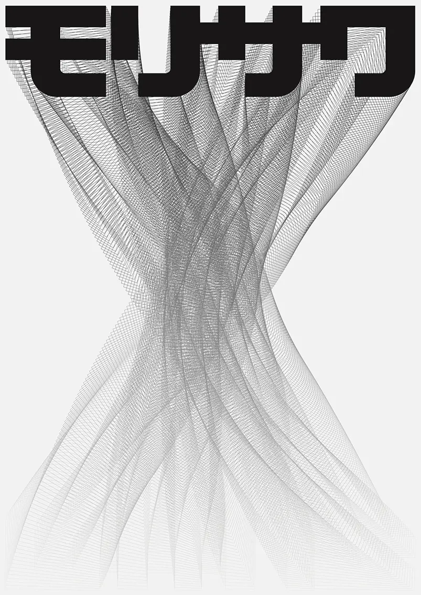            | 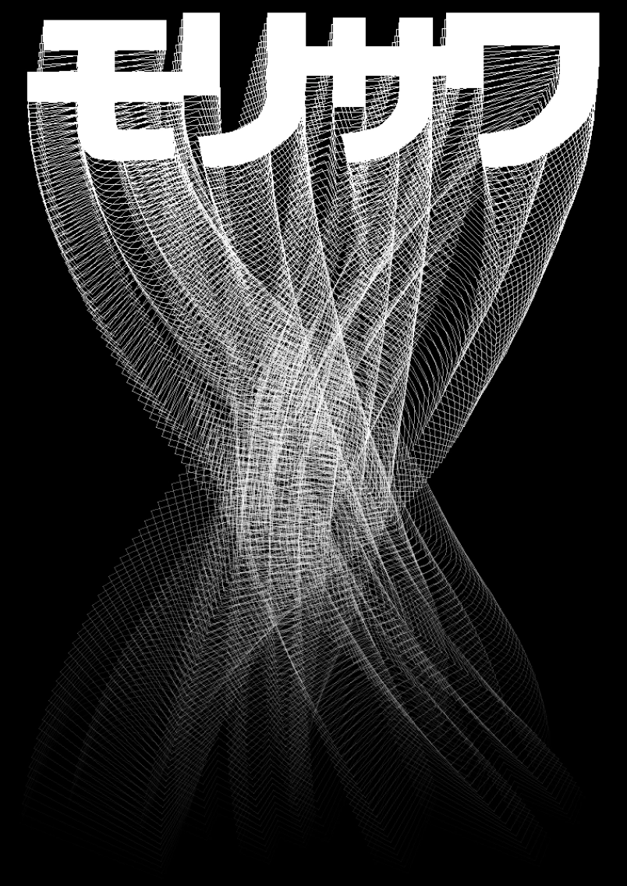             |

- Notes
  - [Live](./maeda/index.html), [Code (JavaScript + WebAssembly)](https://github.com/chuanqisun/code/tree/master/recreating-the-past/maeda/index.html)
  - Source: Morisawa 6 from the Morisawa 10 series, 1996, John Maeda
  - Thought about different approaches: previous assignments were done in Canvas API, a CSS-only approach would be cool as I haven't explored its 3D capabilities before. SVG has potentials but I've hit perf bottleneck before so that's risky.
  - The final version used JavaScript for vectorizing font and managing animation loop. It used WebAssembly for drawing, animation, compositing, and rasterization.
  - The logo type of モリサワ is not coincidental. The lines are simple, with a mixture of straight and curved strokes. Not too dense to bury the patterns.
  - My first few attempts was oscillating the texts left to right. It wasn't doing what John did.
  - Key realization came from seeing John's [reprint in 2024](https://art.gazelliarthouse.com/collections/awaken-metamagical-hands/products/morisawa-6). The bottom reveals that each character is rotated 180 degrees to the cross diagonal position.
  - After finishing 2D animation, I designed a 3D animation, with additional orbit and font size variations
  - Before porting the system to WebAssembly, I also tried CMYK multi-color blending, but CSS engine finally tapped out. I was getting <5 FPS. We need C++
  - Process
    - [CSS 3D proof of concept](./maeda/001-hello.html), [CSS particle system](./maeda/003-particle-system.html), [CSS Variable Font](./maeda/005-typography.html), [Choreography](./maeda/006-choreography.html), [Spin (failed)](./maeda/007-self-spin.html), [Graphics engine from scratch](./maeda/014-wasm-3d-render.html), [TTF font analyzer](./maeda/013-ttf-praser.html)
  - Extras: [3D in CSS](./maeda/012-high-perf-simplified.html), [3D in WASM](./maeda/017-ultimate-2d-wasm.html),

## Week 2: Animation and Harmony

Artist: John Whitney

### Read

> Art is a question of 'you be me'... My excitement in life is to discover something that's significant to me... and not to think, 'Well, I wonder if so-an-so's
> going to like this.'"
> — [Len Lye](https://www.dropbox.com/s/7tmeb0cki0biyit/Articulated%286013%29.pdf?dl=0), by Cecile Starr

### Watch

- [Tutorial on trigonometry](https://www.dropbox.com/s/eadyb0vfsubmzn5/async_5_21.mp4?dl=0)

### Practice

| [Original](https://youtu.be/UA_QcM7Ai1A)                | [Recreated](https://youtube.com/shorts/ghtOiaavP-8)       |
| ------------------------------------------------------- | --------------------------------------------------------- |
| 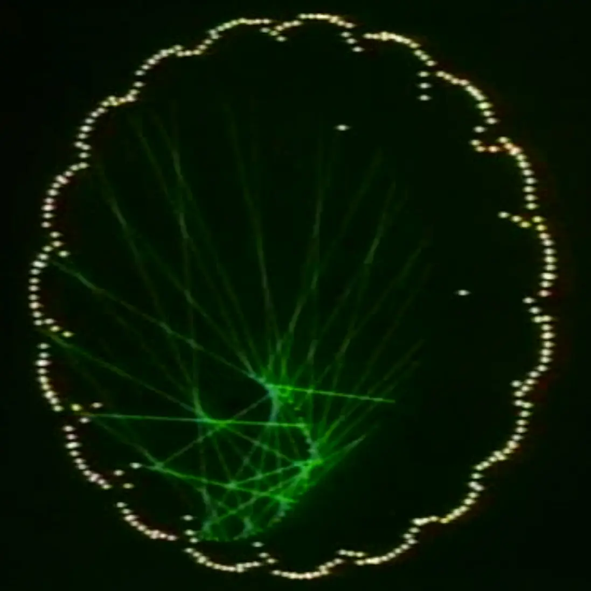 | 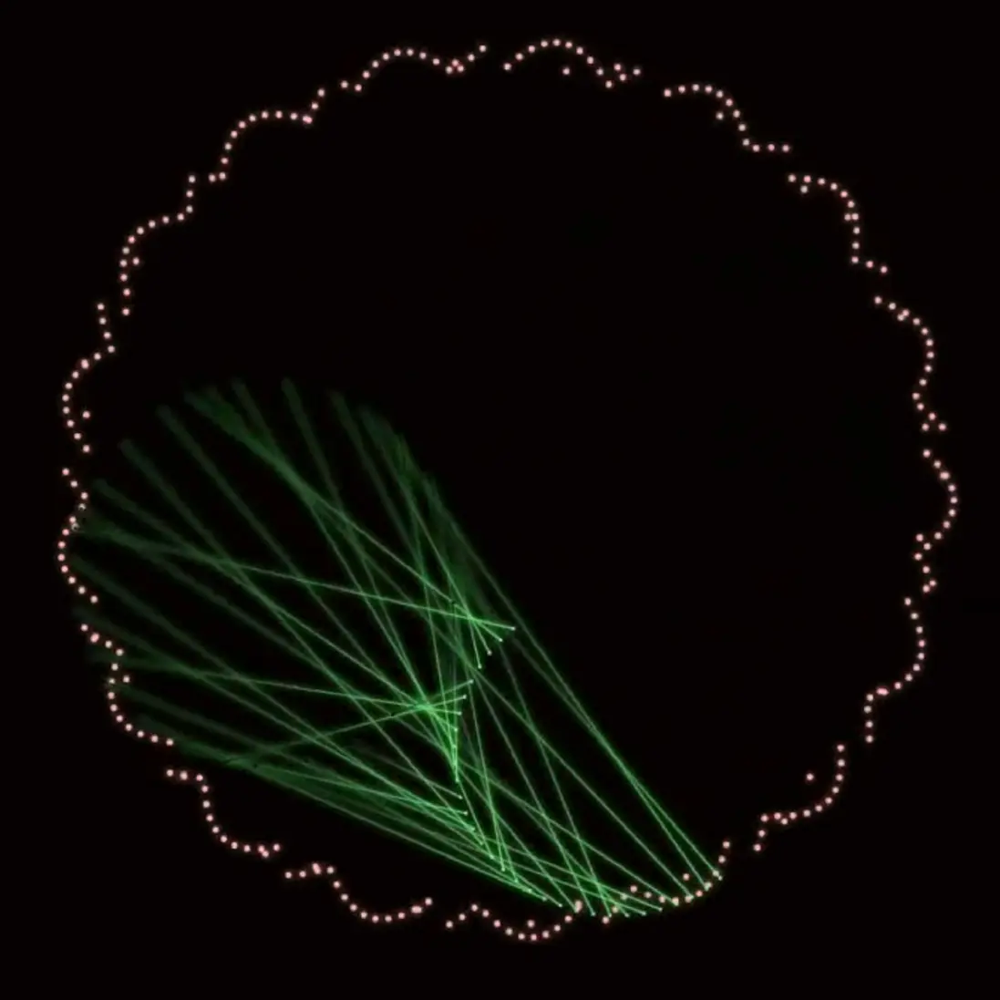 |

- Notes
  - [Live demo](./whitney/), you can play the [sound track](https://strudel.cc/#YXdhaXQgc2FtcGxlcygnZ2l0aHViOnRpZGFsY3ljbGVzL2RpcnQtc2FtcGxlcycpCgokOiBzdGFjaygKICBzKCJ0YWJsYTowIikKICAgIC5kZWdyYWRlQnkoMC41KQogICAgLnN0cnVjdCgieCB%2BIH4gfiB4IH4gfiB%2BIikKICAgIC5nYWluKDEuMCksCgogIHMoInRhYmxhOjMiKQogICAgLnN0cnVjdCgifiB%2BIHggfiB%2BIHggfiB%2BIikKICAgIC5kZWdyYWRlQnkoMC4yKQogICAgLmdhaW4oMC43NSksCgogIHMoInRhYmxhOjIiKQogICAgLnN0cnVjdCgifiB4IH4geCB%2BIH4geCB%2BIikKICAgIC5kZWdyYWRlQnkoMC4yKQogICAgLmdhaW4oMC41NSkuc2xvdygyKSwKCiAgcygiaGgiKQogICAgLnN0cnVjdCgifiB4IH4geCB%2BIHggfiB4IikKICAgIC5nYWluKDAuMjUpCiAgICAuc3dpbmcoNCkKICAgIC5kZWdyYWRlQnkoMC4yKQogICAgLnJvb20oMC4zKSwKCiAgcygibWV0YWw6MiIpCiAgICAuc3RydWN0KCJ4IH4gfiB%2BIH4gfiB%2BIH4gfiB%2BIH4gfiB4IH4gfiB%2BIikKICAgIC5nYWluKDAuNDUpCiAgICAuc3BlZWQoMi41KQogICAgLnJvb20oMC40KQogICAgLnBhbigwLjcpLAoKCiAgbm90ZSgiZDIiKQogICAgLnMoImdtX2Fjb3VzdGljX2Jhc3MiKQogICAgLnN0cnVjdCgieCB%2BIH4gfiB%2BIH4gfiB%2BIikKICAgIC5nYWluKDAuMjUpCiAgICAucm9vbSgwLjYpCiAgICAucmVsZWFzZSgxLjIpLAoKICBzKCJ0YWJsYTo1IikKICAgIC5zd2luZyg0KQogICAgLnN0cnVjdCgieCoxNiIpCiAgICAuZ2FpbigwLjUpCiAgICAuZGVncmFkZUJ5KDAuMikKKQ%3D%3D) from Strudel and share the tab with audio into the visualization app.
  - [Code](https://github.com/chuanqisun/code/tree/master/recreating-the-past/whitney)
  - Source: John Whitney, Permutations (1969)
  - Divide and conquer: I separated the dancing dots from the lines. After solving them individually, I added the sound track to further animate the dots.
  - The green lines:
    - There are always 31 lines. They are projected from one 180-degree arc to a circle.
    - The 180-degree arc's radius oscillates, self-rotates, and orbits around the center of the screen, with its orbit radius oscillating as well.
    - The endpoints on the circle are marching at a speed proportional to the dot's index, creating the twisting effect and periodic dense-sparse rhythm.
    - It takes calculation to both start and end the animation at a specific pattern using the periodicity of a sine wave.
    - They appear to be a gradient between two shades of green, with out-of-phase oscillation of brightness on both sides.
    - The line patterns started and ended very small. I had to hard-code the intro and outro timing.
  - The dancing dots are achieved by applying the same principle as the circle where the green lines originate from, but in addition to step-ramping the rotation angle over time, I also modulated the radius with a circle, so they look like a standing wave wrapped around a circular path.
  - I learned a little bit of Strudel and composed a percussion soundtrack with AI's help.
  - I added a bit of blur to create the visual effects of the old IBM CRT monitor but didn't spend too much time making it retro. For future work, I want to emulate the 24 FPS to see what would come out of it.
  - To make choreography easier, I created a scrubbable timeline tool to allow quick jump. This bridges the gap between creative coding and traditional animation technique.
  - Process
    - Lines: [motion study](./whitney/process/lines/103.html), [orbit study](./whitney/process/lines/200.html), [integration (failed)](./whitney/process/lines/300.html), [oscillation study](./whitney/process/lines/400.html), [motion decoded!](./whitney/process/lines/801.html), [choreography study](./whitney/process/lines/806.html)
    - Dots: [motion study](./whitney/process/dots/001.html), [harmonic progression study](./whitney/process/dots/002.html), [oscillation along circumference (failed)](./whitney/process/dots/003.html), [rose petals (failed)](./whitney/process/dots/004.html), [modulate radius](./whitney/process/dots/005.html)
  - Extras: [photon grammar](https://code.chuanqisun.com/photon-grammar/), [disco ball](https://code.chuanqisun.com/disco-ball/), [dialogarithm](https://code.chuanqisun.com/dialogarithm/)

## Week 1: Chaos and Order

Artist: Vera Molnár

### Read

> It may take a life-time to develop a computer program to make one new communicating pen line which is meaningful for us.  
> — [Computer Grass is Natural Grass](https://www.atariarchives.org/artist/sec5.php) by Colette S. Bangert and Charles J. Bangert

### Watch

- [Tutorial on noise](https://www.dropbox.com/scl/fi/ny6pbyy4z7ww1sqs0seqr/async_5_21.mp4?rlkey=o29twftvovd6k6f692q2kyy5d&e=1&dl=0)

### Practice

| [Original](https://observer.com/2025/07/auctions-sothebys-algorithmic-art-computer-art-grace-hertlein-collection/) | [Recreated](./molnar/)                                       |
| ------------------------------------------------------------------------------------------------------------------ | ------------------------------------------------------------ |
| 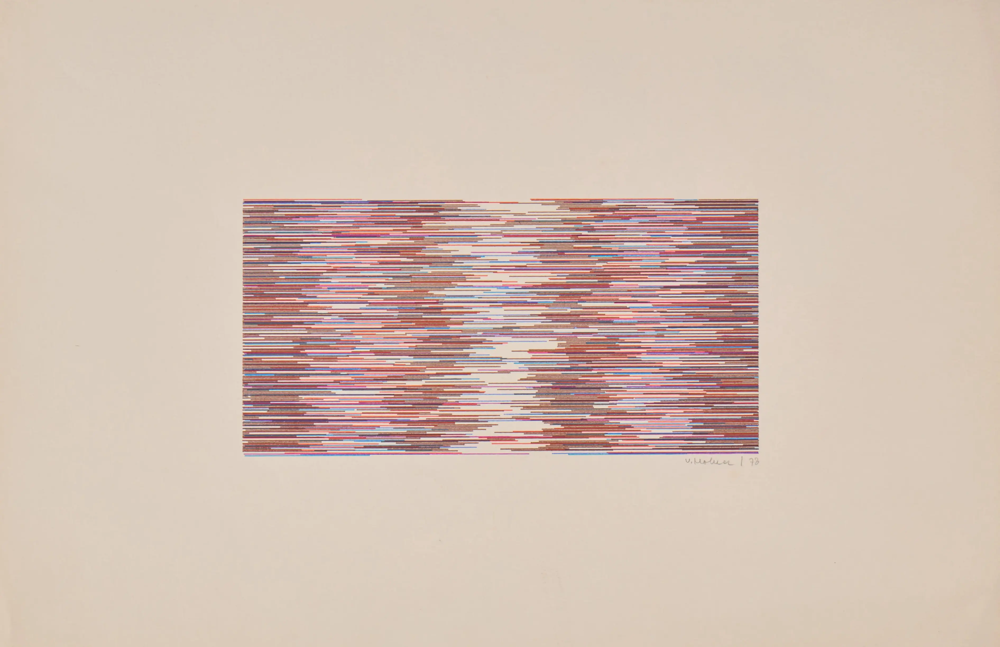                                                         | 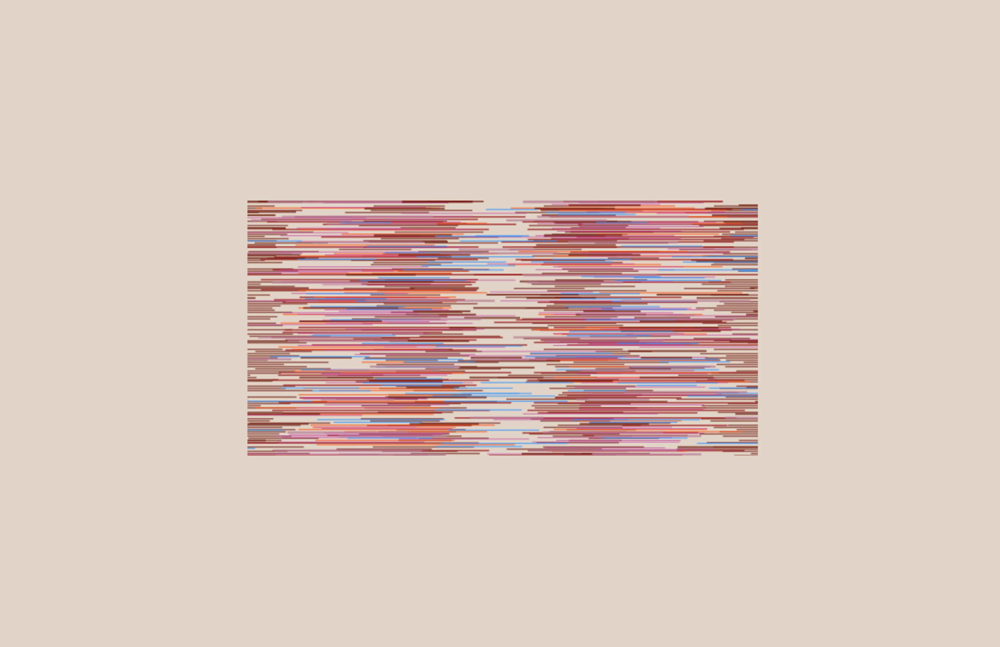 |

- Notes
  - [Code](https://github.com/chuanqisun/code/tree/master/recreating-the-past/molnar)
  - Source: Vera Molnar, artist proof; Signed “V. Molnar / 73” on front, “MIKΡOKOΣMOΣ / epreuve d’artiste, c-5 II” inscribed on verso.
  - Original artwork combines structure with randomness
  - There appears to be a 1,2,4 column layout governing the vertical rhythm
  - Perlin noise applied to the length variation as we render from top to bottom
  - A lot of manual parameter tweaking until the dense-sparse-dense-empty-dense-sparse-dense rhythm felt right
  - Vibe coded [a tool](https://code.chuanqisun.com/color-analyzer/) to extract color palette from any image

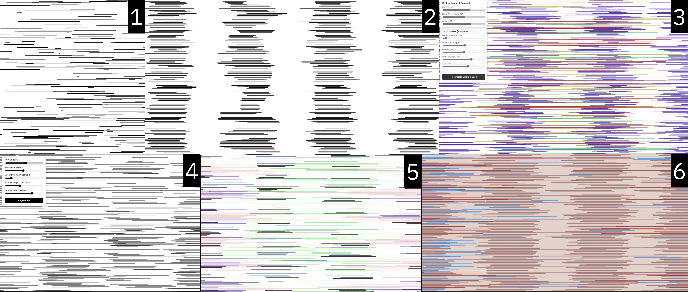

### Extra

- [Hi(gh) Square](./molnar/square.html)
