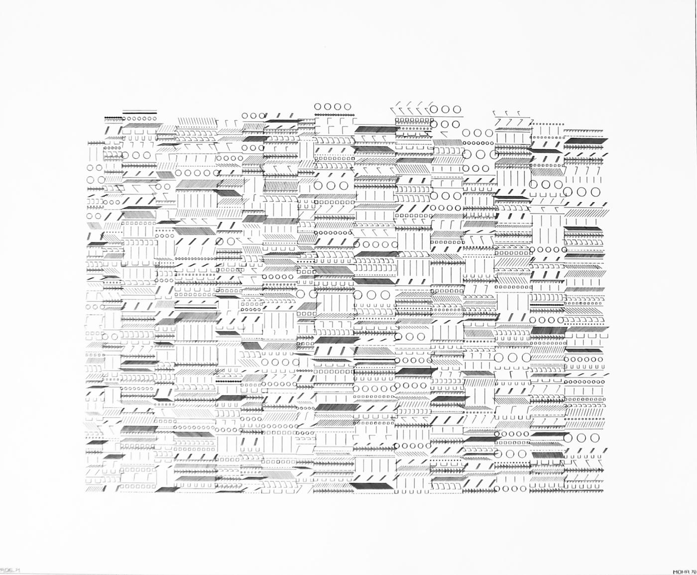
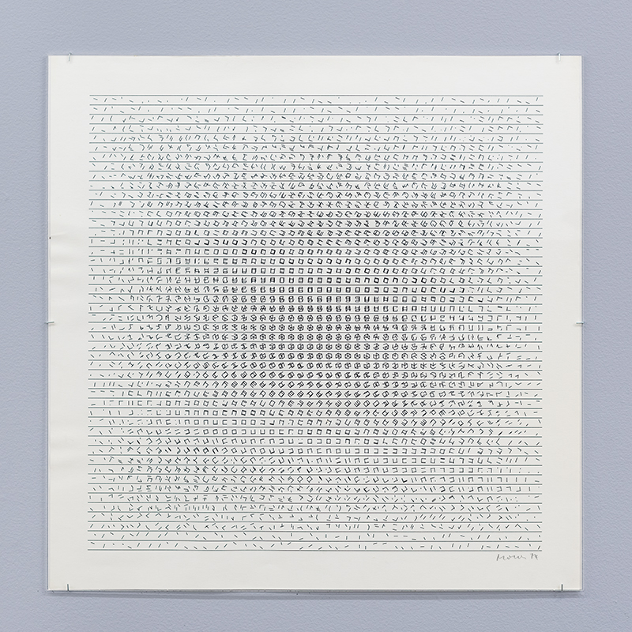
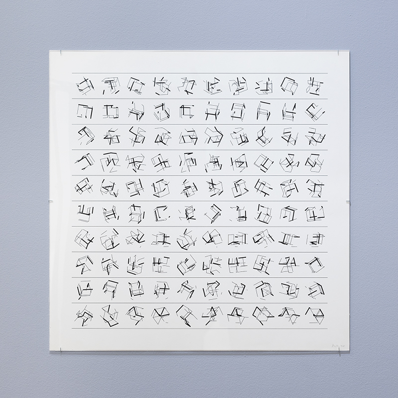
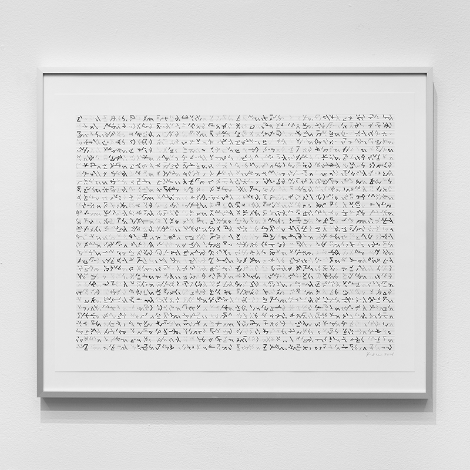
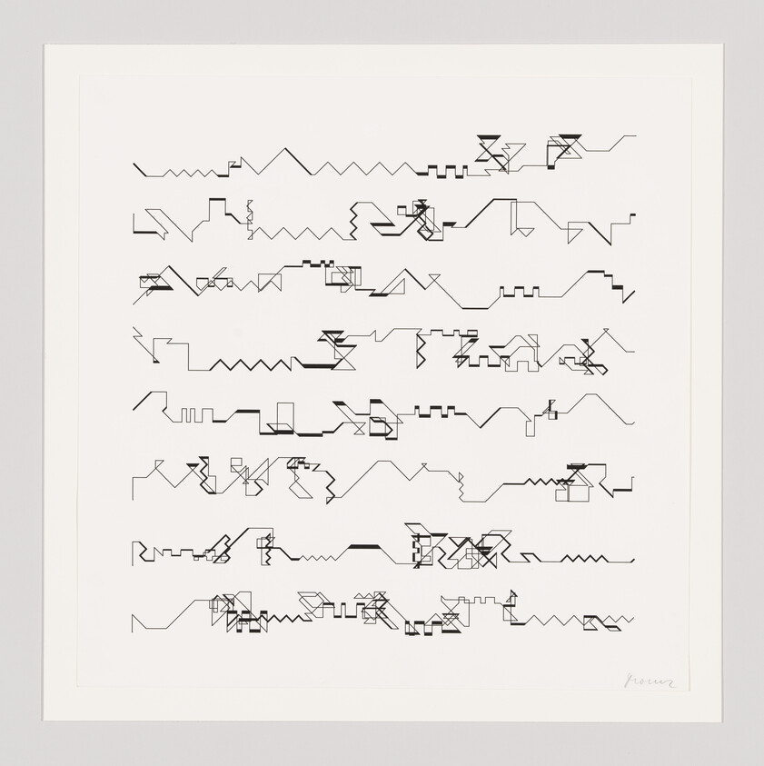
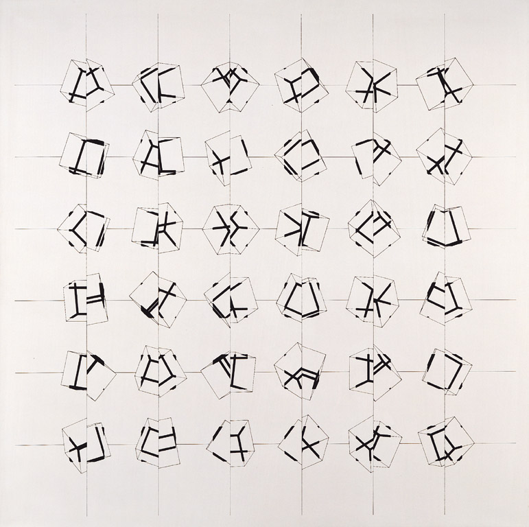
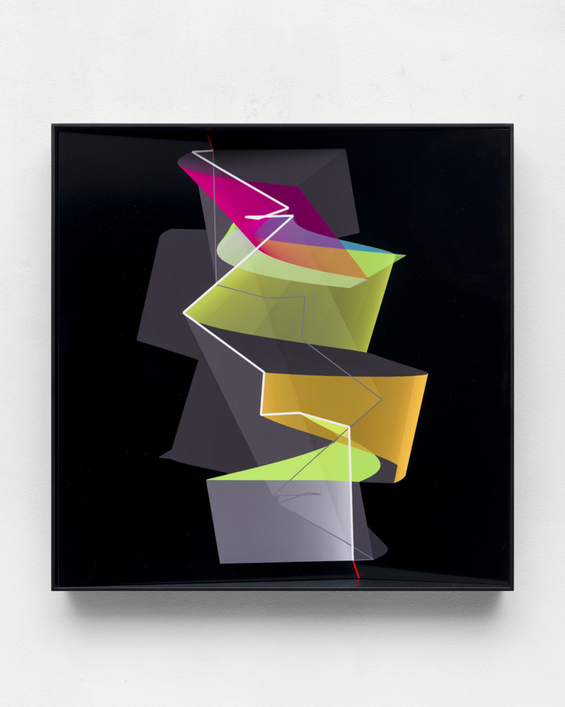

# Manfred Mohr

## Short biography

**Manfred Mohr** was born on **June 8, 1938, in Pforzheim, Germany**. He trained in painting and art history at the Kunst + Werkschule in Pforzheim, and early in life was also a jazz musician, playing tenor saxophone and oboe. He lived in **Barcelona from 1962–63**, **Paris from 1963–83**, and has lived and worked in **New York since the early 1980s**. ([emohr.com](https://www.emohr.com/ManfredMohr_50YearCelebration_TimeLine.html))

Mohr began as an **abstract expressionist / tachist painter**, influenced by jazz, action painting, and modernist abstraction. In the 1960s he encountered **Max Bense’s information aesthetics**, which shifted his thinking toward rational, rule-based art. In 1967 he met the computer-music composer **Pierre Barbaud**, who encouraged him to use programming; Mohr wrote his first computer drawings in **FORTRAN IV in 1969**. ([bitforms.art](https://www.bitforms.art/artist/manfred-mohr/))

In **1971**, the ARC at the Musée d’Art Moderne de la Ville de Paris presented **“Manfred Mohr: Une Esthétique Programmée,”** widely described as the **first solo museum exhibition of computer-generated digital art**. ([bitforms.art](https://www.bitforms.art/exhibition/mohr-2019))

## Artistic importance

Mohr is considered a pioneer of **algorithmic art**, **computer art**, and **generative art**. His importance lies in the fact that he did not use the computer merely as a technical tool; he treated programming as an artistic language. His works are usually generated from **self-authored algorithms**, often involving randomness constrained by rules, which he called **“aesthetical filters.”** ([digitalartmuseum.org](https://digitalartmuseum.org/mohr/1969.html))

A central feature of his mature work is the **cube** and later the **hypercube**. Mohr used geometric structures as “visual instruments,” comparable to the way a musician might use a musical system to generate variations. His art often translates high-dimensional structures into two-dimensional drawings, paintings, plotter works, reliefs, and screen-based installations. ([bitforms.art](https://www.bitforms.art/exhibition/mohr-2019))

## Notable artworks and series

### **P-018, 1969**

An early series made by drawing with light beams directly onto photographic paper. It allowed Mohr to see multiple results generated from the same algorithm. ([bitforms.art](https://www.bitforms.art/exhibition/mohr-2019))

### **P-021 / Band Structures, 1970**

A key early plotter-drawing series. The Whitney Museum holds **Band Structures P-021-U**, dated 1970–83. These works show Mohr’s early use of algorithmic line systems and sequential structures. ([whitney.org](https://whitney.org/collection/works/61415))

### **A Formal Language, 1970**

An important early computer drawing and also the title used for bitforms gallery’s 2019 exhibition celebrating 50 years of Mohr’s algorithmic work. ([bitforms.art](https://www.bitforms.art/exhibition/mohr-2019))

### **P-197 series / Cubic Limit, late 1970s**

Works such as **P-197-F** and **P-197-J** explore the cube as a generative structure. The Mercedes-Benz Art Collection describes **P-197 J, 1979** as making Mohr’s systematic principle visible through serial variation and structural pattern. ([whitney.org](https://whitney.org/artists/19202))

### **Divisibility series**

This body of work divides the cube into parts and projects rotated cube structures into quadrants. It is a good example of Mohr’s interest in turning a spatial/mathematical problem into a visual system. ([art.daimler.com](https://art.daimler.com/en/artwork/p-197-j-manfred-mohr-1979/))

### **Hypercube works**

From the late 1970s onward, Mohr increasingly worked with the **4-D, 5-D, and 6-D hypercube**, translating higher-dimensional relations into visible two-dimensional compositions. Frieder Nake writes that the hypercube became something like Mohr’s “aesthetic homeplace.” ([emohr.com](https://www.emohr.com/nakekatalog_e.html))

### **Liquid Symmetry, 2020–2025**

Mohr’s own timeline describes his later phase as moving from “random walks” in 1969 to **“liquid symmetry”** in 2020–25, showing that his algorithmic practice has continued for more than five decades. ([emohr.com](https://www.emohr.com/ManfredMohr_50YearCelebration_TimeLine.html))

## Interviews and primary sources

Good interviews / conversations to consult:

- **Right Click Save interview**, “An Interview with Manfred Mohr” — covers his early influences, jazz, Pierre Barbaud, code, generative art, and digital art history. ([rightclicksave.com](https://www.rightclicksave.com/article/an-interview-with-manfred-mohr))
- **Art Matters interview**, “Art as a Calculation” — discusses the relation between art history, computers, and new media. ([blogs.uoc.edu](https://blogs.uoc.edu/artmatters/interview-manfred-mohr/))
- **MenschSein mit Algorithmen / Being Human with Algorithms** — interview on digital transformation and Mohr’s long relationship with computers. ([menschsein-mit-algorithmen.org](https://www.menschsein-mit-algorithmen.org/2018/05/16/gesprach-mit-manfred-mohr-uber-die-digitale-transformation/))
- **ZKM, “The Art of Generative Thinking”** — conversation/event focused on his journey from tachist painting and hard-edge abstraction into generative art. ([zkm.de](https://zkm.de/de/veranstaltung/2021/10/the-art-of-generative-thinking))
- **Mohr’s official timeline** — a particularly useful primary source because Mohr summarizes his own work phases, influences, and algorithmic history. ([emohr.com](https://www.emohr.com/ManfredMohr_50YearCelebration_TimeLine.html))

## Writings and publications

Mohr’s practice is unusually well documented through catalogues, work-phase descriptions, diagrams, and algorithmic explanations. Important sources include:

- **“Manfred Mohr: Une Esthétique Programmée,”** 1971 exhibition catalogue, Musée d’Art Moderne de la Ville de Paris.
- **“Algorithmic Works,”** 1998, Josef Albers Museum / Bottrop context.
- **“Manfred Mohr: A Formal Language,”** bitforms gallery, 2019. ([bitforms.art](https://www.bitforms.art/exhibition/mohr-2019))
- Mohr’s **official website**, especially the biography, timeline, work phases, and bibliography. ([emohr.com](https://www.emohr.com/ManfredMohr_50YearCelebration_TimeLine.html))

## Famous or useful quotes

A few concise quotes associated with Mohr and his practice:

> “I can trust the machine.”  
> This phrase is associated with a video interview linked by bitforms and neatly captures Mohr’s belief that the computer can reveal visual consequences of an artist’s logic. ([bitforms.art](https://www.bitforms.art/exhibition/mohr-2019))

> “Visual high-speed thinking.”  
> This phrase is often used in relation to Mohr’s view of the computer as an extension of thought rather than a replacement for artistic intention. ([emohr.com](https://emohr.com/tx_gom_e.html))

> “These shapes … tell stories of an inconceivable, yet computable 6-D space.”  
> Mohr said this about his **Half-Planes** phase, pointing to his fascination with translating higher-dimensional structures into visible form. ([emohr.com](https://www.emohr.com/nakekatalog_e.html))

## Influences on Mohr

### **Jazz and modern music**

Mohr’s early visual work was deeply influenced by music. He cites jazz and modern composition, including **Stan Getz, John Coltrane, Sonny Rollins, Thelonious Monk, Anton Webern, Karlheinz Stockhausen**, and others. His improvisational background helped shape his interest in variation, structure, rhythm, and controlled freedom. ([emohr.com](https://www.emohr.com/ManfredMohr_50YearCelebration_TimeLine.html))

### **Abstract Expressionism / Tachisme**

His early paintings were connected to gestural abstraction, action painting, and Art Informel. Sources mention affinities with **Jackson Pollock**, **Antoni Tàpies**, and the broader climate of postwar abstraction. ([emohr.com](https://www.emohr.com/ManfredMohr_50YearCelebration_TimeLine.html))

### **Max Bense and information aesthetics**

Bense’s theories were decisive. They helped Mohr move from expressive painting toward **rational, programmed, semiotic, and generative art**. ([bitforms.art](https://www.bitforms.art/artist/manfred-mohr/))

### **Pierre Barbaud**

Barbaud, a pioneer of computer music, encouraged Mohr to learn programming and think of algorithmic procedures as artistic composition. ([bitforms.art](https://www.bitforms.art/artist/manfred-mohr/))

### **Constructivism, concrete art, and geometry**

Mohr’s cube and hypercube works relate to modernist traditions of geometric abstraction, concrete art, and constructivist thinking, while extending them through computation.

## Mohr’s influence on others

Mohr influenced later generations of:

- **Generative artists**
- **Creative coders**
- **Plotter artists**
- **Software-based artists**
- **NFT / blockchain-era generative artists**
- **New media theorists and curators**

His significance is that he demonstrated, very early, that **code could be an artistic medium** and that an artwork could be produced from a logical system rather than direct hand gesture. Contemporary generative art platforms and artists working with Processing, p5.js, TouchDesigner, plotters, or blockchain-based long-form generative systems all inherit questions that Mohr helped define: What is the relation between rule and chance? Is the artwork the code, the output, or the system? How much control should an artist give to a machine?

## Key themes in his art

- **Algorithm as artistic language**
- **Rule-based visual systems**
- **Randomness within constraints**
- **The cube and hypercube**
- **From gesture to logic**
- **Music translated into visual structure**
- **Black-and-white rational aesthetics**
- **Computer as collaborator / visual thinking tool**
- **Generative variation**
- **Art as research**

## References

1. [Timeline: Manfred Mohr - 55 Years, 1969 to present, of Creating Computer Generated Art by Writing Algorithms](https://www.emohr.com/ManfredMohr_50YearCelebration_TimeLine.html)
2. [Manfred Mohr - bitforms gallery](https://www.bitforms.art/artist/manfred-mohr/)
3. [A Formal Language: Celebrating 50 Years of Artwork and Algorithms, Manfred Mohr - bitforms gallery](https://www.bitforms.art/exhibition/mohr-2019)
4. [Manfred MOHR Early algorithmic works (1969-1972) at the Digital Art Museum](https://digitalartmuseum.org/mohr/1969.html)
5. [Manfred Mohr | Band Structures P-021-U | Whitney Museum of American Art](https://whitney.org/collection/works/61415)
6. [Manfred Mohr | Whitney Museum of American Art](https://whitney.org/artists/19202)
7. [P-197 J, Manfred Mohr 1979 - Mercedes-Benz Art Collection](https://art.daimler.com/en/artwork/p-197-j-manfred-mohr-1979/)
8. [https://www.emohr.com/nakekatalog_e.html](https://www.emohr.com/nakekatalog_e.html)
9. [An Interview with Manfred Mohr](https://www.rightclicksave.com/article/an-interview-with-manfred-mohr)
10. [Interview with Manfred Mohr: Art as a Calculation - Art Matters](https://blogs.uoc.edu/artmatters/interview-manfred-mohr/)
11. [MenschSein mit Algorithmen | Being Human with Algorithms](https://www.menschsein-mit-algorithmen.org/2018/05/16/gesprach-mit-manfred-mohr-uber-die-digitale-transformation/)
12. [The Art of Generative Thinking | ZKM](https://zkm.de/de/veranstaltung/2021/10/the-art-of-generative-thinking)
13. [https://emohr.com/tx_gom_e.html](https://emohr.com/tx_gom_e.html)
