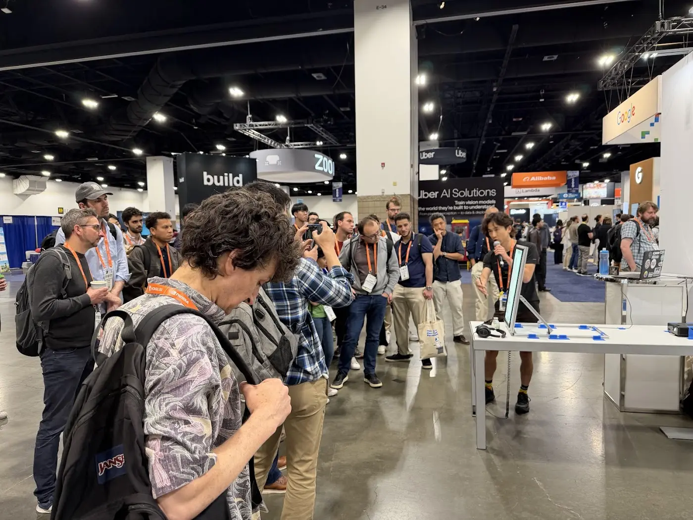
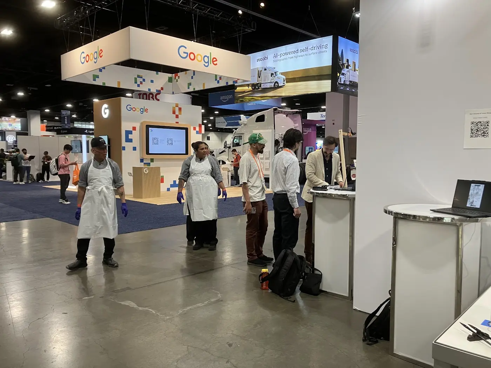
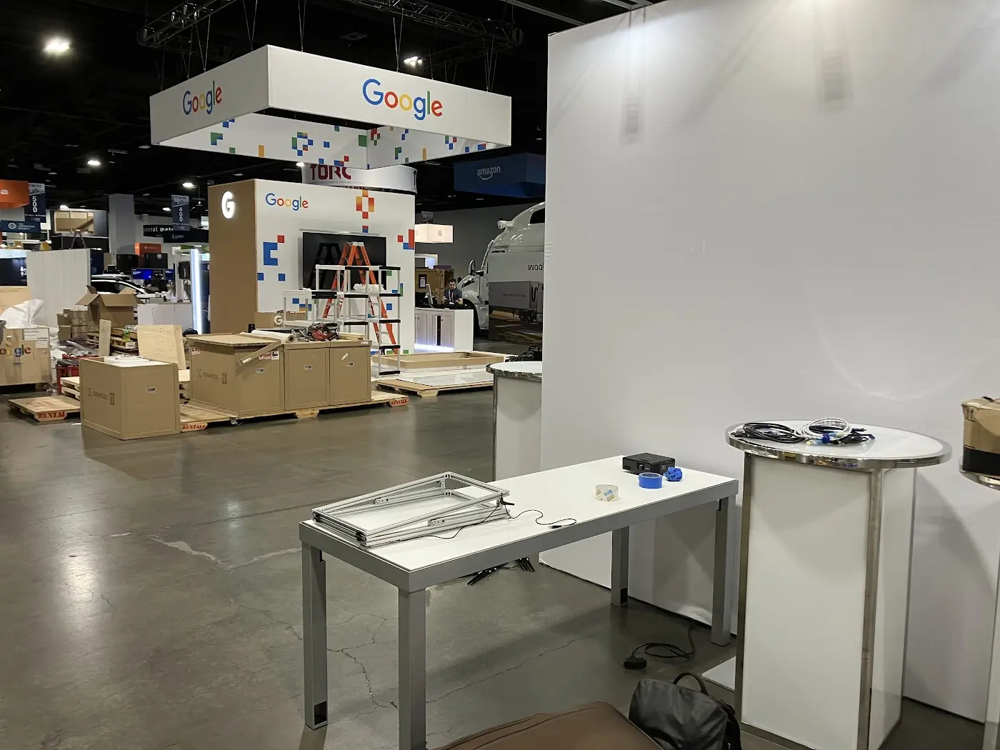
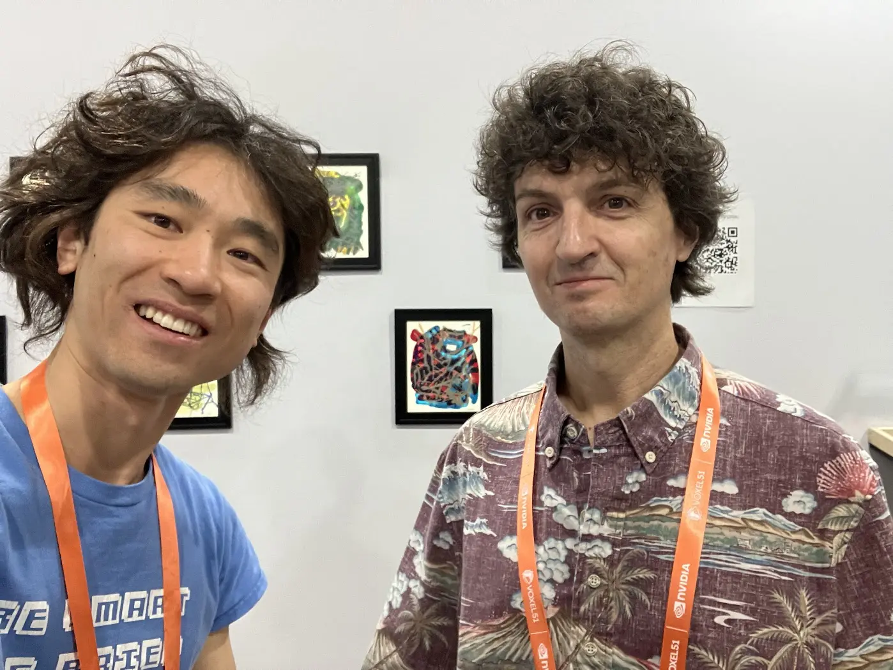
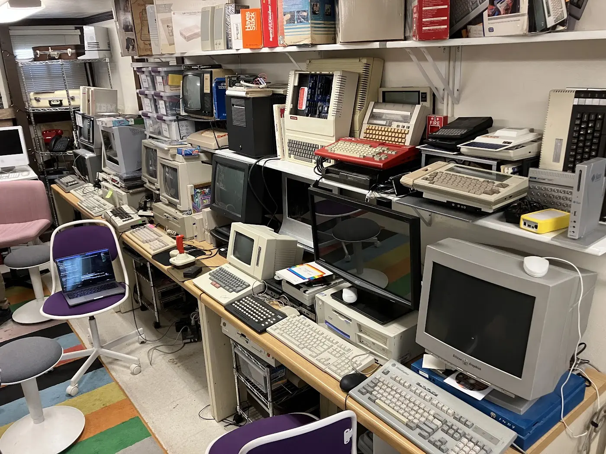
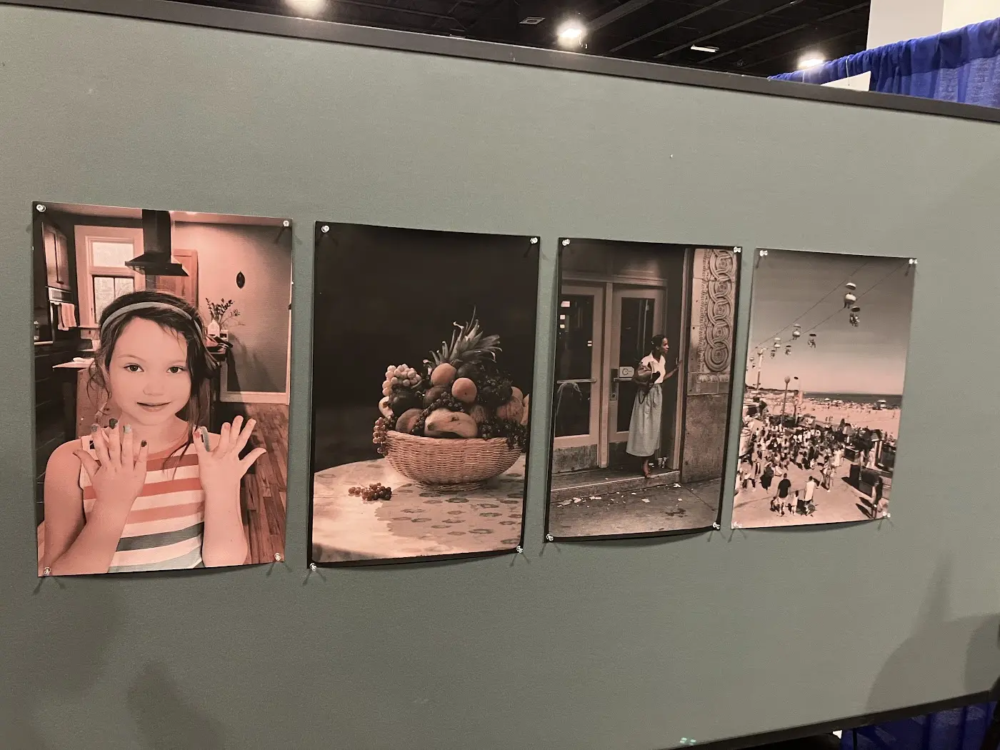
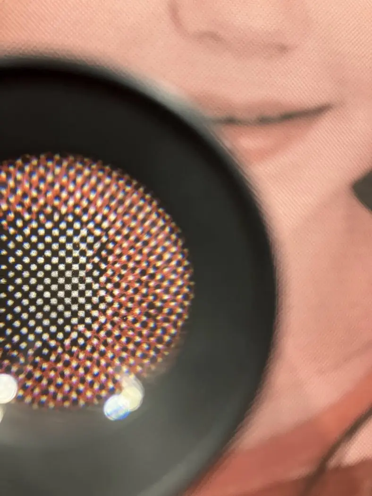

# CVPR 2026

Denver | June 2026

## Research Trends

- **Vision Language Models (VLMs):** A highly active research area. While there is a lot of work on 2D and 3D image generation, the maturity of technologies (like ChatGPT image and "nano banana") has shifted focus toward text-to-video, generative video, and highly specialized 3D model generation.
- **Incremental vs. Quantum Leaps:** Most papers are solving highly specific problems and making minor benchmark improvements rather than introducing net-new, ground-breaking ideas.
- **Cool Highlight:** One notable paper takes a photo of a food plate and uses language models to infer its nutritional value.

## Industry Trends

- **Robotics & Automation:** Massive presence of robotics companies using machine learning and computer vision to automate cars, trucks, drones, robots, and mini food-delivery robots.
- **Big Tech Focus:**
  - **Meta:** Heavily showcasing AR/VR systems.
  - **NVIDIA:** Showing off hardware and their machine learning ecosystem.
  - **Google:** Present, though their exact focus wasn't entirely clear.
  - **Tencent & Alibaba:** Promoting their own proprietary AI models.

## Art Gallery

### Quick Stats & Context

- **Curator:** Luba Elliott (curating since CVPR introduced the art gallery in 2024).
- **Acceptance:** ~140+ accepted submissions, with **24 in-gallery installations**.
- **Major Trend:** A clear shift away from 2D printed/pixel art. The gallery heavily rewards interactivity, webcam-based real-time tracking, and projects that bring abstract AI concepts into the physical space.

### Award Winners (Selected from the 24 In-Gallery Exhibits and 140 Accepted Artworks)

1. **Dream Brush:** Won the **Art Award for Best Presentation**.
2. **[Rest!](https://thecvf-art.com/project.php?year=2026&artist=peekaboo-by-avital-meshi&id=936) (by Avital Meshi & Dorte Bjerre Jensen):** Won **Most Critical Art Piece**. A performance art installation where the artist sleeps on a mattress throughout the entire conference, receiving AI's instructions on how to sleep and what to think. It critically plays on the idea that as AI agents take over our labor, humans can finally take a rest.
3. **[artefact(s): LeNet-1](https://thecvf-art.com/project.php?year=2026&artist=nick-oh&id=992) (by Nick Oh & Alex Park):** Physicalizes a convolutional neural network (CNN) in physical space using light, glass, silicon, LEDs, and resin panels. It acts as an intentional preservation of digital architecture, countering the way software typically disappears.

### Key Exhibit Highlights

- **[Techno-juggling](https://thecvf-art.com/project.php?year=2026&artist=nicolas-romano&id=993) (by Nicolas Romano):**
  - **The Setup:** A tangible juggling system where users manipulate physical tennis balls on a tabletop, triggering colorful visual effects on an underlying screen.
  - **Key Innovation:** Pairs a **polarized lens with a polarized film** so the tracking camera receives zero visual interference from the screen's content, maintaining perfect focus on the physical balls.
  - [Demo video](https://youtube.com/shorts/3O-_IUrgZ7A)
- **[Cubic Visions](https://thecvf-art.com/project.php?year=2026&artist=recurring-concepts-in-art&id=1014) (by Uttam Grandhi):**
  - A 3D-printed physical cube featuring a unique, QR-like code on each side.
  - A real-time video-to-video computer vision system tracks which side of the cube is facing the camera, rendering stylized artworks and interpolating between them as the user rotates the cube.
  - [Demo video](https://youtube.com/shorts/rVDTXcpUr4M)
- **[No.5](https://thecvf-art.com/project.php?year=2026&artist=yamin-xu&id=1025) (by Yamin Xu):**
  - A beautifully fabricated, wearable robotic arm mounted on a person, representing a "parallel mind" fused between human and machine.
  - Features sonar, video feed, touch sensors, and EKG pads that read the wearer's biometric data (one-way biometric reading only—no physical feedback or shocks to the wearer).
  - This project is similar to Yuhan's master's thesis project.
  - [Demo video](https://youtu.be/NvQZtnrVIuE)
- **[Embodied AI: letting computers speak through the body](https://thecvf-art.com/project.php?year=2026&artist=yun-ho&id=1028) (by Yun Ho, Romain Nith, & Pedro Lopes):**
  - A video installation showcasing a different physical form AI can take by moving a dancer's body directly via muscle stimulation.
  - **Note:** Together with **[No.5](https://thecvf-art.com/project.php?year=2026&artist=yamin-xu&id=1025)**, this work explores a similar direction to the _Human Operator_ and _I give AI a body_ projects.

---

### Key Takeaways for TMG

- **The Curator’s Taste:** The curator leans strongly toward easy-to-understand, tactile, and highly interactive physical projects rather than deep, abstract, or purely philosophical inquiries.
- **Designing for the Physical Space:** Physical presence and interactivity drive the most audience engagement. As the art world becomes increasingly saturated with virtual, pixel-based, and generated 2D images, TMG should focus on establishing and maintaining a strong tangible presence.

## Fun stuff

### Videos

- [One of the demo talks I gave](https://youtu.be/gEJOLYvtNb8?si=xATtYiHHq2f-Av6A)
- [Project setup details](https://www.youtube.com/shorts/iQCbSj86YMA)
- [Count the autonomous vehicles (with one outlier)](https://www.instagram.com/reels/DZRcAlTt_rJ/)

### Photo gallery

I gave five demo talks, usually attracting a crowd.  

My neibhor's demo attracted the culinary team. That's how you know the demo is really good!  

Location, location, location. We are lucky to be next to Google booth.  

I ran into Tom White from Media Lab, Aesthetics and Computation Group. Such a special encounter!  

I visited the Media Archeology Lab at Colorado University Boulder. Lots of childhood memories captured in those vintage machines!  

Color Beyond Capture: A Two-Ink Printing Process: A researcher named Christopher Swift invented a two-color pinting process that creates the illusion of full color photos. The implication is huge: we can compress and restore photos using only two colors! This research is guided by the human psychology of color perception, not spectral analysis.

